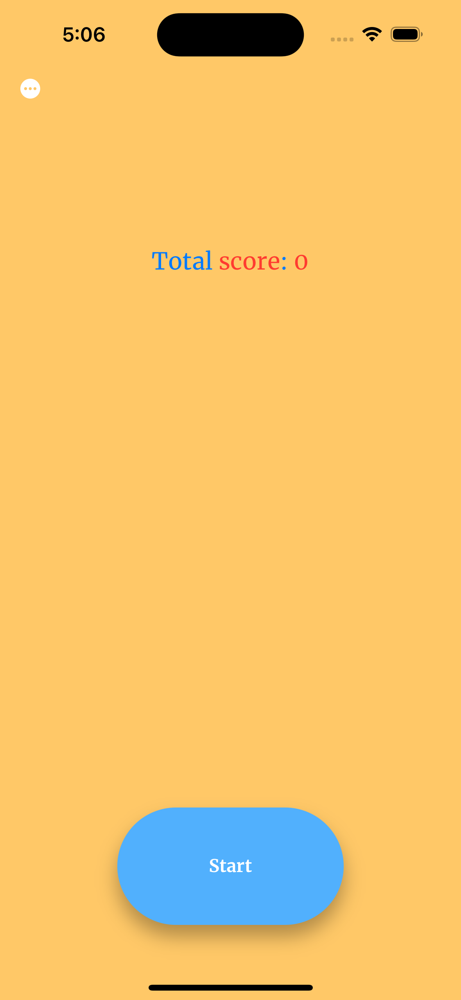
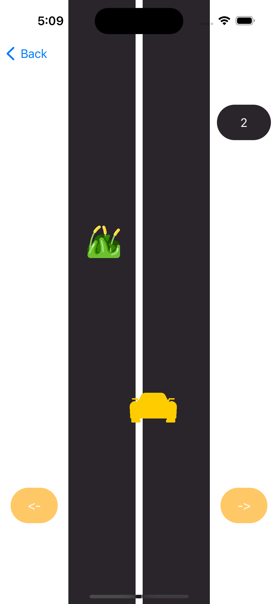
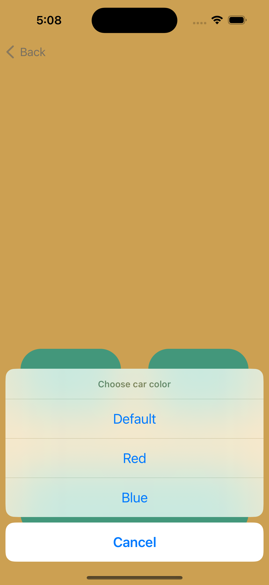
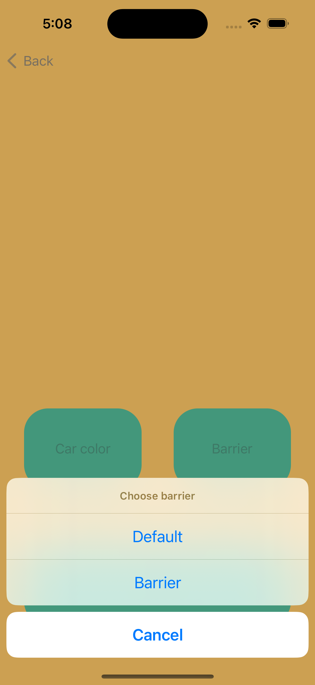
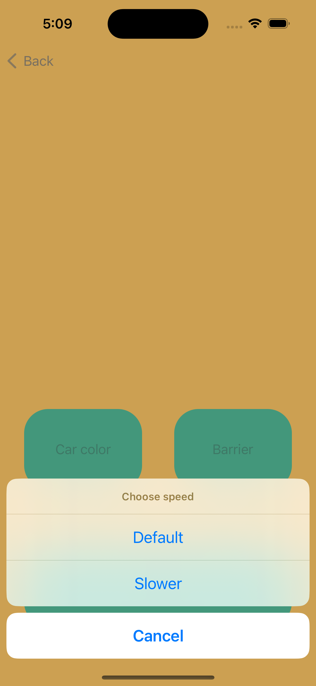

# Race_Game
This is a small game where the user must not crash into an obstacle.

## Features
- Recond table
Settings. 
The user can select: car color, type of obstacle, speed.

## How to use
1. Clone this project.  
`git clone `
2. Open this repo in terminal.
3. Print `pod install`.
4. Open Race_Game.xcworkspace in Xcode.

## Preview
### Onboarding Screen

### Race Screen

### Records Screen

### Settings Screen

